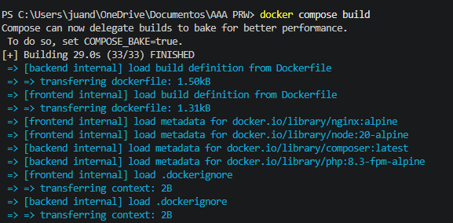
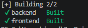
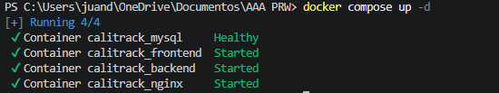

nav:
  - Inicio: index.md
  - Arquitectura: arquitectura.md
  - Frontend: frontend.md
  - Backend: backend.md
  - Despliegue Docker: despliegue.md
  - CI/CD y GitHub Pages: cicd.md
  - Planes y facturación: ssg.md
  - API: api.md
Y crea docs/despliegue.md:
markdown# Despliegue con Docker

## Requisitos previos

- Docker Desktop instalado y en ejecución
- Git para clonar el repositorio

No se requiere PHP, Node.js, ni ninguna otra dependencia — todo corre dentro de los contenedores.

## Clonar y construir

```bash
git clone https://github.com/BaywatchZEfron/CaliTrack
cd CaliTrack
docker compose build
```

El build construye dos imágenes personalizadas:

**Frontend** — proceso en dos etapas:

1. `node:20-alpine` instala dependencias y compila Vue con `npm run build`
2. `nginx:alpine` sirve los archivos estáticos generados en `dist/`

**Backend** — una sola etapa:

1. `php:8.3-fpm-alpine` instala extensiones PHP necesarias (pdo_mysql, mbstring, bcmath, gd)
2. Composer instala dependencias de producción (`--no-dev`)
3. Se limpian paquetes de desarrollo del caché de autodiscovery

```bash
docker compose build
```




## Levantar los contenedores

```bash
docker compose up -d
```

El flag `-d` ejecuta los contenedores en segundo plano. Docker Compose respeta el orden de dependencias:

1. `mysql` arranca primero y espera a estar `healthy`
2. `backend` arranca cuando MySQL está listo
3. `frontend` arranca en paralelo
4. `nginx` arranca cuando frontend y backend están disponibles

```bash
docker compose ps
```



## Primer despliegue — migraciones y seeders

```bash
# Crear las tablas en la base de datos
docker exec -it calitrack_backend php artisan migrate --force

# Poblar el catálogo de ejercicios (20 ejercicios de calistenia)
docker exec -it calitrack_backend php artisan db:seed --force

# Opcional: crear usuario demo con 12 semanas de datos
docker exec -it calitrack_backend php artisan db:seed --class=DemoUserSeeder --force
```

## Configuración de los contenedores

### nginx/default.conf — Proxy inverso

```nginx
server {
    listen 80;
    server_name _;

    location / {
        proxy_pass http://frontend:80;
        proxy_set_header Host $host;
        proxy_set_header X-Real-IP $remote_addr;
    }

    location /api/ {
        root /var/www/public;
        try_files $uri $uri/ /index.php?$query_string;

        location ~ \.php$ {
            fastcgi_pass backend:9000;
            fastcgi_index index.php;
            fastcgi_param SCRIPT_FILENAME /var/www/public$fastcgi_script_name;
            include fastcgi_params;
        }
    }
}
```

Este archivo configura Nginx como proxy inverso:

- Las rutas `/api/*` se pasan a PHP-FPM en el contenedor backend por FastCGI
- El resto de rutas se sirven desde el contenedor frontend
- `$host` y `$remote_addr` propagan las cabeceras correctas al backend

### docker-compose.yml — Orquestación

```yaml
services:
  mysql:
    image: mysql:8.0
    healthcheck:
      test: ["CMD", "mysqladmin", "ping", "-h", "localhost"]
      interval: 10s
      retries: 5

  backend:
    build: ./backend
    depends_on:
      mysql:
        condition: service_healthy

  frontend:
    build: ./frontend

  nginx:
    image: nginx:alpine
    ports:
      - "80:80"
    depends_on:
      - frontend
      - backend
```

El `healthcheck` en MySQL garantiza que Laravel no intenta conectarse antes de que la base de datos esté lista. Sin esto, el backend arrancaría antes que MySQL y fallaría en la primera petición.

## Variables de entorno

El backend usa `backend/.env.docker` con las variables de producción:

```env
APP_ENV=production
APP_KEY=base64:...
DB_HOST=mysql        # nombre del servicio Docker, no localhost
DB_PORT=3306
DB_DATABASE=calitrack
DB_USERNAME=calitrack
DB_PASSWORD=secret
```

El `DB_HOST=mysql` es clave — dentro de Docker los contenedores se resuelven por nombre de servicio, no por IP ni `localhost`.

## Verificación

Una vez levantado, la app está disponible en `http://localhost`.

Credenciales demo: `demo@calitrack.com` / `demo1234`
