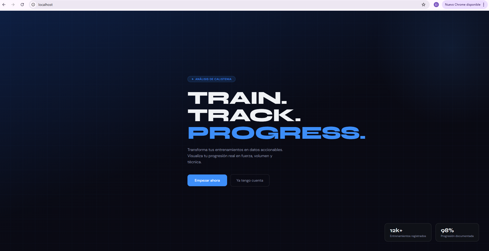
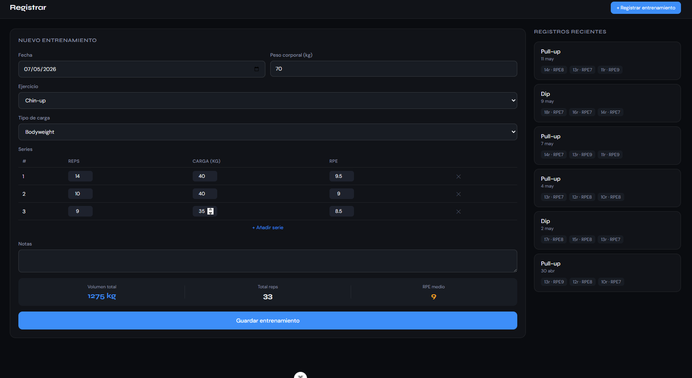
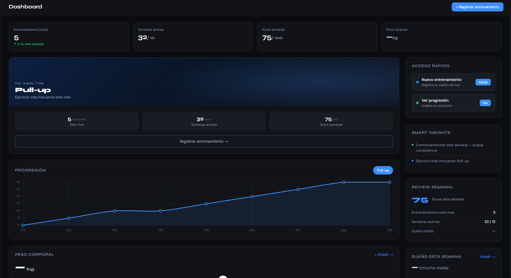
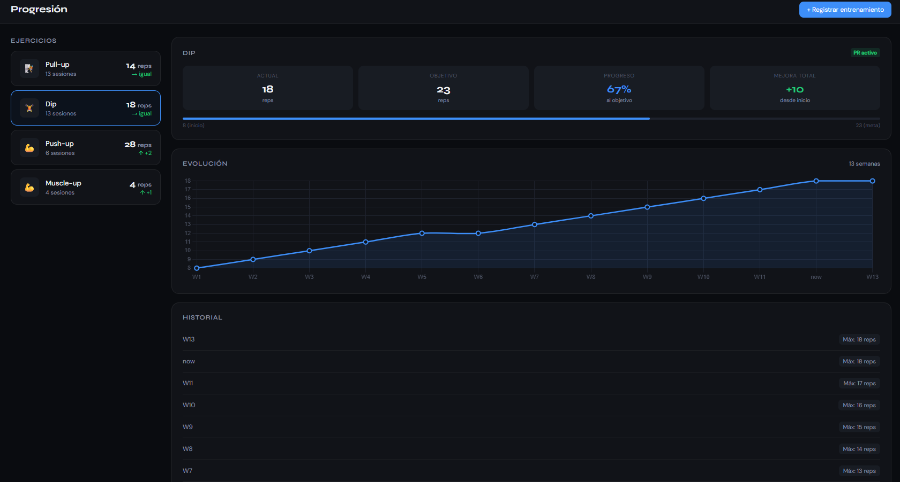
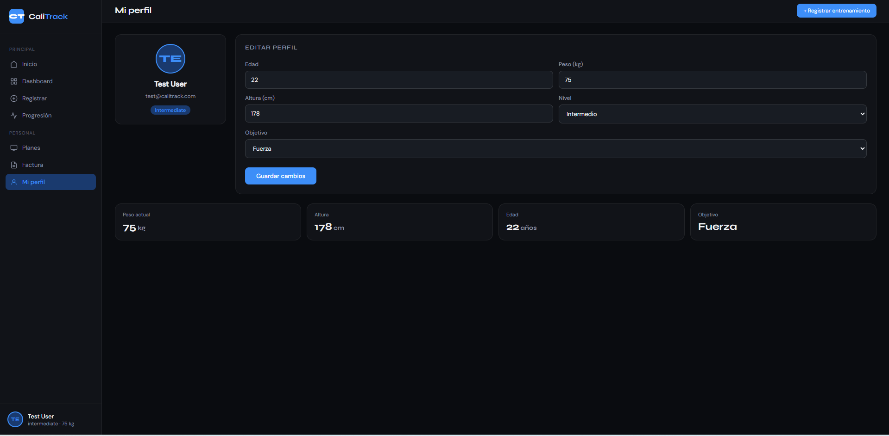

# Frontend — Vue 3 + TypeScript

CaliTrack usa **Vue 3** como framework de interfaz, con **TypeScript** para tipado estático, **Pinia** para gestión de estado global, **Vue Router** para navegación y **Axios** para comunicación con la API.

---

## Stack y versiones

| Tecnología | Versión | Rol |
|---|---|---|
| Vue 3 | 3.x | Framework UI |
| TypeScript | 5.x | Tipado estático |
| Vite | 5.x | Bundler y servidor de desarrollo |
| Pinia | 2.x | Estado global (auth) |
| Vue Router | 4.x | Navegación SPA |
| Axios | 1.x | Peticiones HTTP a la API |
| Chart.js + vue-chartjs | 4.x | Gráficas de progresión |

---

## Estructura de directorios

```
frontend/
├── src/
│   ├── main.ts                  ← Punto de entrada. Monta la app y llama fetchUser()
│   ├── App.vue                  ← Componente raíz. Contiene <RouterView>
│   ├── router/
│   │   └── index.ts             ← Rutas y navigation guard (requiresAuth)
│   ├── stores/
│   │   └── auth.ts              ← Store Pinia: token, user, login, logout, register
│   ├── services/
│   │   ├── api.ts               ← Instancia Axios centralizada con interceptores
│   │   ├── workoutService.ts    ← Llamadas a /api/workouts
│   │   ├── dashboardService.ts  ← Llamadas a /api/dashboard
│   │   └── progressService.ts  ← Llamadas a /api/progress
│   ├── composables/
│   │   ├── useDashboard.ts      ← Estado reactivo del dashboard
│   │   ├── useProgress.ts       ← Estado reactivo de la progresión
│   │   └── useWorkoutLog.ts     ← Estado reactivo del formulario de log
│   ├── types/
│   │   └── index.ts             ← Interfaces TypeScript alineadas con la API
│   ├── views/
│   │   ├── SplashView.vue
│   │   ├── LoginView.vue
│   │   ├── OnboardingView.vue
│   │   ├── DashboardView.vue
│   │   ├── LogView.vue
│   │   ├── ProgressView.vue
│   │   ├── ProfileView.vue
│   │   ├── PlansView.vue
│   │   └── InvoiceView.vue
│   └── layouts/
│       └── AppLayout.vue        ← Sidebar + título dinámico. Envuelve las vistas autenticadas
├── .env                         ← VITE_API_URL según entorno
├── vite.config.ts
└── tsconfig.app.json
```

---

## Variables de entorno

El frontend necesita saber a qué URL apuntar para las peticiones API. Esto cambia según el entorno:

```bash
# frontend/.env  →  para Docker (producción local)
VITE_API_URL=http://localhost/api

# frontend/.env.local  →  para desarrollo con Laravel Herd
VITE_API_URL=http://backend.test/api
```

> **Por qué `VITE_` como prefijo:** Vite solo expone al navegador las variables que empiezan con `VITE_`. El resto quedan privadas en el proceso de build. Si no añades el prefijo, la variable será `undefined` en el cliente.

Se accede en el código así:

```ts
const baseURL = import.meta.env.VITE_API_URL
```

---

## Axios centralizado — `src/services/api.ts`

Todos los servicios del frontend usan una sola instancia de Axios. Esto evita repetir la URL base y los headers en cada llamada.

```ts
import axios from 'axios'

// Crea una instancia con la URL base leída del .env
const api = axios.create({
  baseURL: import.meta.env.VITE_API_URL,
})

// INTERCEPTOR DE PETICIÓN:
// Antes de enviar cualquier request, añade el token de autenticación al header
api.interceptors.request.use((config) => {
  const token = localStorage.getItem('auth_token')
  if (token) {
    // Laravel Sanctum espera "Bearer <token>" en cada petición protegida
    config.headers.Authorization = `Bearer ${token}`
  }
  return config
})

// INTERCEPTOR DE RESPUESTA:
// Si la API devuelve 401 (no autorizado), el token ya no es válido
api.interceptors.response.use(
  (response) => response,  // Si va bien, devuelve la respuesta tal cual
  (error) => {
    if (error.response?.status === 401) {
      // Borra el token caducado y redirige al login
      localStorage.removeItem('auth_token')
      window.location.href = '/login'
    }
    return Promise.reject(error)
  }
)

export default api
```

**Por qué este diseño:**

- Sin este interceptor, cada vista tendría que añadir manualmente `Authorization: Bearer ...` en cada llamada. Con el interceptor, se hace automáticamente para todos los endpoints protegidos.
- El interceptor de respuesta 401 garantiza que si el token caduca (por ejemplo, después de días sin usar la app), el usuario es redirigido al login en lugar de ver errores silenciosos.

---

## Tipos TypeScript — `src/types/index.ts`

Los tipos definen la forma exacta de los datos que llegan desde la API. Si la API cambia un campo, TypeScript detecta el error en tiempo de compilación.

```ts
// Representa al usuario autenticado
// Coincide con la tabla `users` de la base de datos
export interface User {
  id: number
  name: string
  email: string
  age: number | null
  height_cm: number | null
  weight_kg: number | null
  level: 'beginner' | 'intermediate' | 'advanced'
  goal: 'strength' | 'endurance' | 'weight_loss' | 'skill'
  plan: 'free' | 'premium'   // ← usado en PlansView e InvoiceView
}

// Ejercicio del catálogo (tabla `exercises`)
export interface Exercise {
  id: number
  name: string              // ej: "Pull-up", "Dip", "Planche lean"
  muscle_group: string      // ej: "back", "chest"
  category: string          // ej: "pull", "push"
  is_default: boolean       // true = ejercicio del sistema
}

// Serie concreta dentro de un workout (tabla `sets`)
export interface WorkoutSet {
  id?: number
  set_number: number        // orden: 1, 2, 3...
  reps: number              // repeticiones realizadas
  weight_kg: number         // 0 si es bodyweight
  is_assistance: boolean    // true si usó banda elástica o similar
  rpe: number               // esfuerzo percibido 0-10
}

// Ejercicio dentro de una sesión (tabla `workout_exercises`)
export interface WorkoutExercise {
  id?: number
  exercise_id: number
  exercise?: Exercise
  load_type: 'bodyweight' | 'weighted' | 'assisted'
  order_index: number
  rest_time: number | null
  notes: string | null
  sets: WorkoutSet[]
}

// Sesión de entrenamiento (tabla `workouts`)
export interface Workout {
  id: number
  date: string              // formato: "2024-03-15"
  duration_minutes: number | null
  workout_exercises: WorkoutExercise[]
}

// Punto en la gráfica de progresión (un dato por semana)
export interface ProgressPoint {
  week: string              // ej: "2024-W10"
  avg_reps: number
  max_weight: number
  total_volume: number      // reps × peso total
}

// Progresión completa de un ejercicio
export interface ExerciseProgress {
  exercise: Exercise
  data: ProgressPoint[]
}

// KPIs del dashboard
export interface DashboardData {
  workouts_this_month: number
  active_weeks: number
  performance_score: number
  most_frequent_exercise: string | null
  progression_summary: string | null
  insights: Insight[]
}

// Insight generado automáticamente en el dashboard
export interface Insight {
  type: 'positive' | 'warning' | 'info'
  message: string
}
```

**Verificar que no hay errores de tipos:**

```bash
cd frontend
npx vue-tsc --noEmit --project tsconfig.app.json
```

Si este comando termina sin output, el tipado es correcto en todo el proyecto.

---

## Pinia — Store de autenticación (`src/stores/auth.ts`)

Pinia es el gestor de estado global. En CaliTrack se usa para un único store: el de autenticación. Esto centraliza el token, el usuario y las acciones de login/logout.

```ts
import { defineStore } from 'pinia'
import { ref } from 'vue'
import type { User } from '@/types'
import api from '@/services/api'

export const useAuthStore = defineStore('auth', () => {
  // Estado reactivo: cualquier componente que lea estas variables
  // se actualizará automáticamente cuando cambien
  const token = ref<string | null>(localStorage.getItem('auth_token'))
  const user = ref<User | null>(null)

  // Llama a GET /api/user para obtener los datos del usuario autenticado
  // Se ejecuta en main.ts al arrancar la app
  async function fetchUser() {
    if (!token.value) return
    try {
      const response = await api.get('/user')
      user.value = response.data
    } catch {
      // Si falla (token inválido), limpia el estado
      token.value = null
      localStorage.removeItem('auth_token')
    }
  }

  // POST /api/auth/login → recibe token → lo guarda en localStorage y en el store
  async function login(email: string, password: string) {
    const response = await api.post('/auth/login', { email, password })
    token.value = response.data.token
    localStorage.setItem('auth_token', response.data.token)
    await fetchUser()
  }

  // POST /api/auth/register → igual que login pero con más campos
  async function register(data: Partial<User> & { password: string }) {
    const response = await api.post('/auth/register', data)
    token.value = response.data.token
    localStorage.setItem('auth_token', response.data.token)
    await fetchUser()
  }

  // POST /api/auth/logout → invalida el token en el servidor
  async function logout() {
    await api.post('/auth/logout')
    token.value = null
    user.value = null
    localStorage.removeItem('auth_token')
  }

  // PUT /api/user/profile → actualiza campos del perfil
  async function updateProfile(data: Partial<User>) {
    const response = await api.put('/user/profile', data)
    user.value = response.data.user
  }

  // Computed: true si hay token activo
  const isAuthenticated = computed(() => !!token.value)

  return { token, user, isAuthenticated, fetchUser, login, register, logout, updateProfile }
})
```

**Por qué un solo store de auth:**
El resto de datos (workouts, progresión, dashboard) son específicos de cada vista y se gestionan con composables. No tiene sentido guardar en estado global datos que solo usa una pantalla.

---

## Vue Router y Navigation Guard (`src/router/index.ts`)

El router define las rutas y protege las páginas que requieren autenticación.

```ts
import { createRouter, createWebHistory } from 'vue-router'
import { useAuthStore } from '@/stores/auth'

const routes = [
  { path: '/',          name: 'splash',    component: () => import('@/views/SplashView.vue') },
  { path: '/login',     name: 'login',     component: () => import('@/views/LoginView.vue') },
  { path: '/onboarding',name: 'onboarding',component: () => import('@/views/OnboardingView.vue') },
  {
    // AppLayout envuelve todas las vistas autenticadas
    // Contiene el sidebar y el header con título dinámico
    path: '/',
    component: () => import('@/layouts/AppLayout.vue'),
    meta: { requiresAuth: true },  // ← marca todo este grupo como protegido
    children: [
      { path: '/dashboard', name: 'dashboard', component: () => import('@/views/DashboardView.vue') },
      { path: '/log',       name: 'log',       component: () => import('@/views/LogView.vue') },
      { path: '/progress',  name: 'progress',  component: () => import('@/views/ProgressView.vue') },
      { path: '/profile',   name: 'profile',   component: () => import('@/views/ProfileView.vue') },
      { path: '/plans',     name: 'plans',     component: () => import('@/views/PlansView.vue') },
      { path: '/invoice',   name: 'invoice',   component: () => import('@/views/InvoiceView.vue') },
    ]
  }
]

const router = createRouter({
  history: createWebHistory(),
  routes,
})

// NAVIGATION GUARD:
// Antes de cargar cualquier ruta, comprueba si requiere autenticación
router.beforeEach((to) => {
  const auth = useAuthStore()
  if (to.meta.requiresAuth && !auth.isAuthenticated) {
    // Redirige al login si la ruta es protegida y no hay sesión
    return { name: 'login' }
  }
})

export default router
```

**Por qué lazy loading (`() => import(...)`):**
Cada vista se carga solo cuando el usuario navega a ella. Esto reduce el tamaño del bundle inicial y hace que la primera carga sea más rápida.

---

## Composables

Los composables encapsulan la lógica reactiva de cada sección. La vista llama al composable y solo se encarga de mostrar los datos, sin lógica de negocio.

### `useWorkoutLog.ts`

```ts
import { ref } from 'vue'
import type { Exercise, WorkoutExercise, WorkoutSet } from '@/types'
import { getExercises, createWorkout } from '@/services/workoutService'

export function useWorkoutLog() {
  const exercises = ref<Exercise[]>([])     // catálogo completo
  const selectedExercise = ref<Exercise | null>(null)
  const loadType = ref<'bodyweight' | 'weighted' | 'assisted'>('bodyweight')
  const sets = ref<WorkoutSet[]>([])
  const loading = ref(false)
  const error = ref<string | null>(null)

  // Carga los ejercicios disponibles al montar la vista
  async function loadExercises() {
    exercises.value = await getExercises()
  }

  // Añade una serie vacía al array (el usuario la rellena en el formulario)
  function addSet() {
    sets.value.push({
      set_number: sets.value.length + 1,
      reps: 0,
      weight_kg: 0,
      is_assistance: false,
      rpe: 0,
    })
  }

  // Envía el workout completo a la API
  async function submitWorkout() {
    if (!selectedExercise.value) return
    loading.value = true
    try {
      await createWorkout({
        date: new Date().toISOString().split('T')[0],  // "2024-03-15"
        workout_exercises: [{
          exercise_id: selectedExercise.value.id,
          load_type: loadType.value,
          order_index: 1,
          sets: sets.value,
        }]
      })
    } catch (e) {
      error.value = 'Error al guardar el entrenamiento'
    } finally {
      loading.value = false
    }
  }

  return { exercises, selectedExercise, loadType, sets, loading, error, loadExercises, addSet, submitWorkout }
}
```

**Uso en `LogView.vue`:**
```vue
<script setup lang="ts">
import { onMounted } from 'vue'
import { useWorkoutLog } from '@/composables/useWorkoutLog'

const { exercises, selectedExercise, sets, addSet, submitWorkout, loadExercises } = useWorkoutLog()
onMounted(loadExercises)
</script>
```

La vista no sabe cómo se cargan los ejercicios ni cómo se construye el objeto a enviar. Solo llama a las funciones y muestra los datos reactivos.

---

## Vistas principales

### SplashView

Pantalla de entrada con diseño oscuro, tipografía grande y grid de fondo. Muestra dos botones: _Iniciar sesión_ y _Comenzar ahora_.



No tiene lógica: solo navegación con `useRouter()`.

---

### OnboardingView — registro multistep



El onboarding se divide en pasos para no abrumar al usuario con un formulario largo. Internamente es un único componente con un `step` reactivo:

```ts
const step = ref(1)  // 1 = cuenta, 2 = datos físicos, 3 = objetivo y nivel

// Avanza al siguiente paso validando el actual
function nextStep() {
  if (step.value < 3) step.value++
}
```

Al completar el paso 3, llama a `register()` del auth store que hace `POST /api/auth/register` y guarda todos los campos del perfil en el mismo request.

---

### DashboardView



Carga datos de `GET /api/dashboard` mediante `useDashboard`. Muestra:

- **KPIs**: entrenamientos del mes, semanas activas, performance score, ejercicio más frecuente
- **Gráfica**: progresión semanal del ejercicio principal con `vue-chartjs`
- **Insights**: mensajes automáticos generados en el backend según el historial (ej: "Llevas 3 semanas sin hacer Pull-up")

La gráfica usa `LineChart` de vue-chartjs:

```vue
<LineChart :data="chartData" :options="chartOptions" />
```

Donde `chartData` es un `computed` que transforma el array `ProgressPoint[]` al formato que espera Chart.js:

```ts
const chartData = computed(() => ({
  labels: progressData.value.map(p => p.week),     // ["W10", "W11", "W12"]
  datasets: [{
    label: 'Reps promedio',
    data: progressData.value.map(p => p.avg_reps),  // [8, 9, 10]
    borderColor: '#6366f1',
    tension: 0.4,
  }]
}))
```

---

### ProgressView



Flujo:
1. Carga lista de ejercicios que el usuario ha usado (desde `GET /api/progress`)
2. Al seleccionar uno, muestra la gráfica semanal de ese ejercicio
3. KPIs por ejercicio: mejor serie, volumen total, tendencia

---

### ProfileView



Formulario con campos: nombre, edad, altura, peso, nivel, objetivo. Al guardar llama a `updateProfile()` del auth store que hace `PUT /api/user/profile`.

---

### PlansView e InvoiceView

PlansView muestra las tarjetas Free/Premium. El botón "Upgrade" llama directamente a `updateProfile({ plan: 'premium' })`.

InvoiceView genera una factura en pantalla con los datos reales del usuario (`user.name`, `user.email`, `user.plan`). Incluye un botón que llama a `window.print()` para generar PDF desde el navegador.

---

## `main.ts` — arranque de la app

```ts
import { createApp } from 'vue'
import { createPinia } from 'pinia'
import App from './App.vue'
import router from './router'
import { useAuthStore } from './stores/auth'

const app = createApp(App)
app.use(createPinia())
app.use(router)

// Antes de montar la app, intenta restaurar la sesión del usuario
// Si hay token en localStorage, obtiene los datos del usuario de la API
// Esto evita que al recargar la página el usuario aparezca desconectado
const auth = useAuthStore()
await auth.fetchUser()

app.mount('#app')
```

**Por qué `await` antes de `mount`:**
Si se montara la app primero, el navigation guard correría antes de saber si hay sesión activa. El usuario con token válido sería redirigido al login por un instante. Con el `await`, cuando el router evalúa la ruta, ya sabe si hay sesión.

---

## AppLayout — sidebar y navegación

`AppLayout.vue` envuelve todas las vistas autenticadas. Contiene:

- **Sidebar** con enlaces a: Dashboard, Registrar, Progresión, Perfil, Planes, Factura
- **Header** con el título de la vista actual (obtenido de `route.meta.title`)
- `<RouterView />` donde se inyecta la vista activa

```vue
<template>
  <div class="app-layout">
    <aside class="sidebar">
      <RouterLink to="/dashboard">Dashboard</RouterLink>
      <RouterLink to="/log">Registrar</RouterLink>
      <RouterLink to="/progress">Progresión</RouterLink>
      <RouterLink to="/profile">Perfil</RouterLink>
      <RouterLink to="/plans">Planes</RouterLink>
      <RouterLink to="/invoice">Factura</RouterLink>
      <button @click="auth.logout()">Salir</button>
    </aside>
    <main>
      <RouterView />
    </main>
  </div>
</template>
```

---

## Comandos frecuentes

```bash
# Instalar dependencias
cd frontend
npm install

# Servidor de desarrollo (con Herd activo)
npm run dev
# → http://localhost:5173

# Build para producción
npm run build

# Verificar tipos TypeScript (debe terminar sin output si todo es correcto)
npx vue-tsc --noEmit --project tsconfig.app.json

# Preview del build
npm run preview
```

---

## Decisiones técnicas

| Decisión | Alternativa descartada | Motivo |
|---|---|---|
| Pinia en lugar de Vuex | Vuex 4 | Pinia es la solución oficial para Vue 3, sintaxis más simple |
| Composition API con `<script setup>` | Options API | Menos boilerplate, mejor inferencia de tipos con TypeScript |
| Composables por sección | Todo en el store | El estado del dashboard o del log es local a esa vista, no global |
| Axios centralizado en `api.ts` | fetch nativo | Interceptores, manejo de errores centralizado, cancellation |
| Lazy loading de vistas | Import estático | Reduce el bundle inicial, mejora tiempo de primera carga |
| `await fetchUser()` antes de mount | Guard async en router | Garantiza que el estado de auth esté listo antes de cualquier evaluación de ruta |