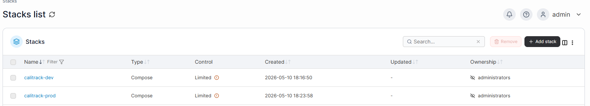
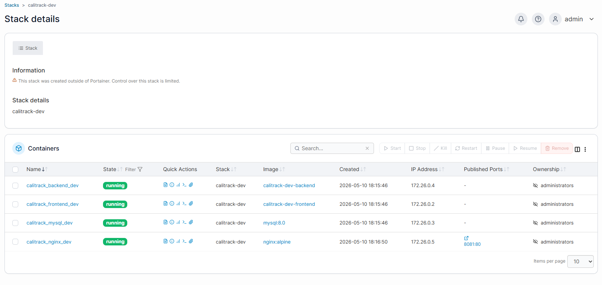
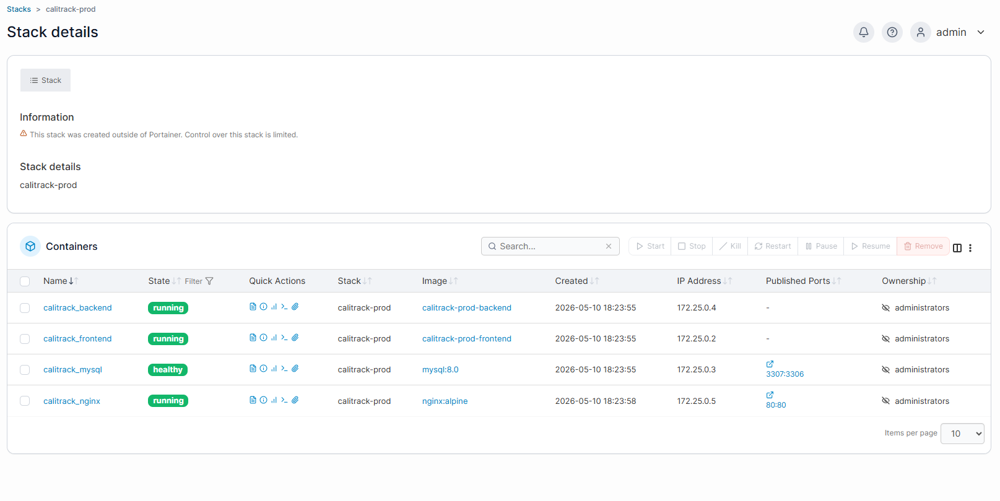
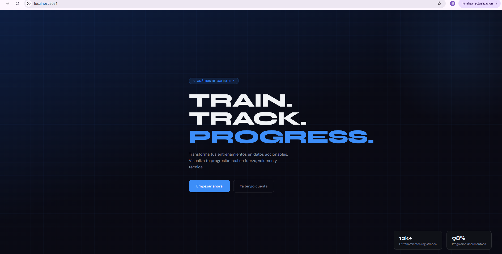
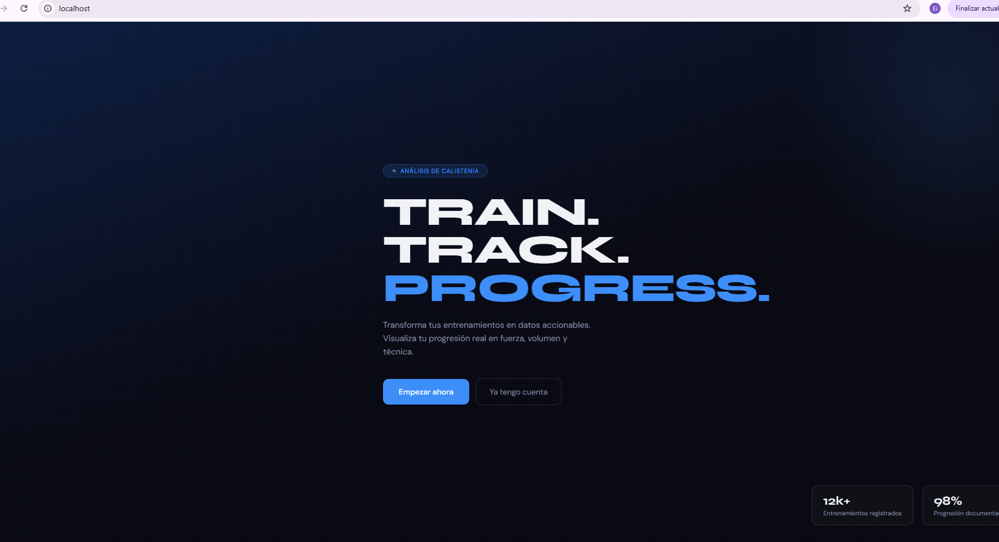

# Dos entornos con Portainer

CaliTrack despliega dos entornos diferenciados gestionados con **Portainer** sobre Docker Desktop. Ambos corren en la misma máquina local con configuraciones, puertos y bases de datos completamente separados.

---

## Resumen de entornos

| | Entorno Dev | Entorno Prod |
|---|---|---|
| Stack en Portainer | `calitrack-dev` | `calitrack-prod` |
| URL de acceso | `http://localhost:8081` | `http://localhost:80` |
| `APP_ENV` | `local` | `production` |
| `APP_DEBUG` | `true` | `false` |
| Base de datos | `calitrack_dev` | `calitrack_prod` |
| Puerto nginx | `8081:80` | `80:80` |
| Puerto MySQL | — | `3307:3306` |

---

## Instalar Portainer

Portainer se instala como un contenedor Docker independiente. Solo se hace una vez.

```bash
docker volume create portainer_data

docker run -d \
  -p 8000:8000 \
  -p 9443:9443 \
  --name portainer \
  --restart=always \
  -v /var/run/docker.sock:/var/run/docker.sock \
  -v portainer_data:/data \
  portainer/portainer-ce:latest
```

Accede en: **https://localhost:9443**

---

## Levantar los dos entornos

```bash
# Entorno PROD
cd "C:\Users\juand\OneDrive\Documentos\AAA PRW"
docker compose -p calitrack-prod up -d

# Entorno DEV
docker compose -f docker-compose.dev.yml -p calitrack-dev up -d
```

---

## Stacks en Portainer



Ambos stacks aparecen con tipo **Compose** asignados al grupo **administrators**. El aviso *"Control over this stack is limited"* indica que fueron creados desde la terminal en lugar de desde la UI de Portainer, lo que no afecta a la visibilidad ni al funcionamiento.

---

## Detalle del entorno Dev



El stack `calitrack-dev` contiene 4 contenedores, todos en estado **running**:

| Contenedor | Imagen | Puerto publicado |
|---|---|---|
| `calitrack_backend_dev` | `calitrack-dev-backend` | — (interno) |
| `calitrack_frontend_dev` | `calitrack-dev-frontend` | — (interno) |
| `calitrack_mysql_dev` | `mysql:8.0` | — (interno) |
| `calitrack_nginx_dev` | `nginx:alpine` | **8081:80** |

---

## Detalle del entorno Prod



El stack `calitrack-prod` contiene 4 contenedores:

| Contenedor | Imagen | Puerto publicado | Estado |
|---|---|---|---|
| `calitrack_backend` | `calitrack-prod-backend` | — (interno) | running |
| `calitrack_frontend` | `calitrack-prod-frontend` | — (interno) | running |
| `calitrack_mysql` | `mysql:8.0` | **3307:3306** | healthy |
| `calitrack_nginx` | `nginx:alpine` | **80:80** | running |

MySQL expone el puerto `3307` para permitir conexión directa desde herramientas externas como TablePlus o DBeaver. El estado **healthy** indica que el healthcheck de MySQL está pasando correctamente.

---

## Verificación en el navegador

**Entorno Dev — http://localhost:8081**



**Entorno Prod — http://localhost**



Ambos muestran la misma aplicación pero son instancias completamente independientes. Cualquier registro creado en dev no aparece en prod y viceversa.

---

## Diferencias clave entre entornos

```bash
# Dev
APP_ENV=local
APP_DEBUG=true      # Laravel muestra stack traces detallados en errores
DB_DATABASE=calitrack_dev

# Prod
APP_ENV=production
APP_DEBUG=false     # Laravel muestra errores genéricos sin exponer código interno
DB_DATABASE=calitrack_prod
```

Con `APP_DEBUG=false` en prod, si la API falla, Laravel devuelve un mensaje genérico en lugar del stack trace completo. Esto es una práctica estándar de seguridad.

---

## Inicializar la base de datos de cada entorno

```bash
# DEV
docker exec -it calitrack_backend_dev php artisan migrate --force
docker exec -it calitrack_backend_dev php artisan db:seed --force
docker exec -it calitrack_backend_dev php artisan db:seed --class=DemoUserSeeder --force

# PROD
docker exec -it calitrack_backend php artisan migrate --force
docker exec -it calitrack_backend php artisan db:seed --force
docker exec -it calitrack_backend php artisan db:seed --class=DemoUserSeeder --force
```

Credenciales del usuario demo en ambos entornos:

```
Email:    demo@calitrack.com
Password: demo1234
```